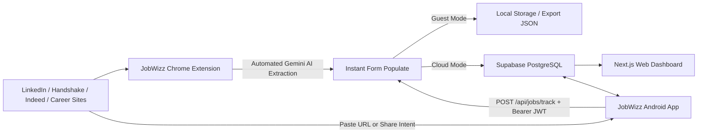

# 🚀 JobWizz — Automated Job Application Tracker

**JobWizz** is an end-to-end job application tracking ecosystem built to streamline your job search. It pairs a **Manifest V3 Chrome Extension** (with automated Gemini AI and DOM scraping across LinkedIn, Handshake, Indeed, and generic career sites) with a **Next.js Web Dashboard** powered by **Supabase** for real-time tracking, status management, and analytics.

---

## 🌟 How It Works



---

## 🧩 How to Use This Extension

The JobWizz extension is ready to use directly in Google Chrome.

### 1. Download & Load the Extension
1. Clone or download this repository (or download the `extension/` folder).
2. Open Google Chrome and navigate to `chrome://extensions/`.
3. Enable **Developer mode** using the toggle in the top-right corner.
4. Click **Load unpacked** and select the `JobWizz/extension` folder.
5. Pin the **JobWizz** icon to your browser toolbar for quick access.

### 2. Auto-Capture Applications
1. Open any job posting on **LinkedIn** (`linkedin.com/jobs/view/...`), **Handshake** (`joinhandshake.com/jobs/...`), **Indeed**, or company career sites (Greenhouse, Lever, etc.).
2. Click the **JobWizz** extension icon.
3. The extension automatically extracts the **Role**, **Company**, **Location**, **Salary / Compensation Range**, **Date Applied**, and **Job Link** using Gemini AI with instant DOM fallback.
4. Review the details, add optional notes, and choose your save mode:
   - **Save Locally**: Stores the application in your browser offline. You can click **Export JSON** to download a backup file anytime.
   - **Save to Cloud**: Sign in directly within the extension popup to sync applications in real time to your cloud dashboard.

---

## 💻 Running Locally (For Development)

If you want to run the full stack locally:

### 1. Database Setup
1. Create a free project at [supabase.com](https://supabase.com).
2. Open the **SQL Editor** in Supabase and run the SQL commands from [`supabase/schema.sql`](./supabase/schema.sql).
3. Copy your **Project URL** and **Publishable / Anon API Key** from **Project Settings > API**.

### 2. Configure Environment & Extension Secrets
- In `dashboard/`, create a `.env.local` file (gitignored):
  ```env
  NEXT_PUBLIC_SUPABASE_URL=https://your-project.supabase.co
  NEXT_PUBLIC_SUPABASE_ANON_KEY=your-supabase-publishable-key
  ```
- In `extension/lib/`, create `config.js` from the template (gitignored):
  ```bash
  cp extension/lib/config.example.js extension/lib/config.js
  ```
  Then fill in your keys:
  ```javascript
  export const GEMINI_API_KEY = 'your-gemini-api-key';
  export const SUPABASE_URL = 'https://your-project.supabase.co';
  export const SUPABASE_ANON_KEY = 'your-supabase-publishable-key';
  ```

### 3. Start the Next.js Web Dashboard
```bash
cd dashboard
npm install
npm run dev
```
Open [http://localhost:3000](http://localhost:3000) in your browser.

### 4. Start the Android / Mobile App (React Native with Expo)
```bash
cd mobile
npm install
npx expo start
```
- **Physical Phone**: Scan the terminal QR code using the free [Expo Go](https://play.google.com/store/apps/details?id=host.exp.exponent) app.
- **Android Emulator**: Press `a` in the terminal.
- **Web Browser**: Press `w` in the terminal to preview instantly in your browser.

---

## 📱 Android App Features
- **⚡ 1-Tap Paste & Track**: Paste any job posting URL or tap **"📋 Paste Clipboard"**. Gemini AI automatically scrapes and parses Role, Company, Location, and Salary via the backend `/api/jobs/track` route.
- **📤 Native Android Share Target**: When viewing jobs in LinkedIn, Indeed, or Chrome, tap **Share ➡️ JobWizz** to automatically load the link into Quick Track!
- **📊 Real-time Dashboard**: Filter applications by status (Applied, Interview, Offer, Rejected), search by keyword, edit status/notes on the go, or delete records.
- **🔄 Universal Cloud Sync**: Shares the same Supabase database and authentication session as your Chrome Extension and Web Dashboard.

---

## 🌐 Deploying the Dashboard to Vercel

1. Push this repository to GitHub.
2. Go to [vercel.com](https://vercel.com) and click **Add New Project** → Import your repository.
3. Set the **Root Directory** to `dashboard`.
4. In **Environment Variables**, add:
   - `NEXT_PUBLIC_SUPABASE_URL` = `https://your-project.supabase.co`
   - `NEXT_PUBLIC_SUPABASE_ANON_KEY` = `your-supabase-publishable-key`
   - `GEMINI_API_KEY` = `your-gemini-api-key`
5. Click **Deploy**.

---

## 🗄️ Database Schema

The database schema, indexing, and Row Level Security (RLS) policies are maintained in [`supabase/schema.sql`](./supabase/schema.sql).

---

## 📁 Repository Structure

```
JobWizz/
├── dashboard/          # Next.js Web Dashboard source code (App Router)
├── extension/          # Chrome Extension source code (Manifest V3)
│   ├── background/     # Service worker
│   ├── content/        # Content scripts (LinkedIn, Handshake, Generic)
│   ├── lib/            # AI (Gemini), Supabase client, Auth, Config, Storage
│   └── popup/          # Extension popup UI & controller
├── mobile/             # React Native (Expo) Android App
│   ├── src/
│   │   ├── contexts/   # Supabase Auth Provider
│   │   ├── lib/        # Supabase client, Backend API caller, Types
│   │   └── screens/    # Quick Track, Dashboard, Settings, Auth
│   ├── App.tsx         # Root component with bottom tab navigation
│   └── app.json        # Expo & Android Intent Filter config
└── supabase/           # Database schemas, migrations & security policies
    └── schema.sql
```
