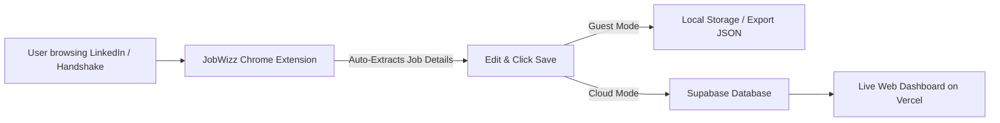

# 🚀 JobWizz — Automated Job Application Tracker

**JobWizz** is an end-to-end job application tracking ecosystem built to streamline your job search. It pairs a **Manifest V3 Chrome Extension** (which auto-captures job postings from LinkedIn and Handshake) with a **Next.js Web Dashboard** powered by **Supabase** for real-time tracking, status management, and analytics.

---

## 🌟 How It Works



---

## 🧩 How to Use This Extension

The JobWizz extension is ready to use directly in Google Chrome.

### 1. Download & Load the Extension
1. Clone or download this repository (or download the `extension/` folder).
2. Open Google Chrome and navigate to `chrome://extensions/`.
3. Enable **Developer mode** using the toggle in the top-right corner.
4. Click **Load unpacked** and select the `JobWizz/extension` folder.
5. Pin the **JobWizz** icon to your browser toolbar for quick access.

### 2. Auto-Capture Applications
1. Open any job posting on **LinkedIn** (`linkedin.com/jobs/view/...`) or **Handshake** (`joinhandshake.com/jobs/...`).
2. Click the **JobWizz** extension icon.
3. The job's **Role**, **Company**, **Location**, **Date Applied**, and **Job Link** will be automatically populated.
4. Review the details, add optional interview/salary notes, and choose your save mode:
   - **Save Locally**: Stores the application in your browser. You can click **Export JSON** to download a backup file anytime.
   - **Save to Cloud**: Sign in directly within the extension popup to sync applications in real time to your web dashboard.

---

## 💻 Running Locally (For Development)

If you want to run the full stack locally:

### 1. Database Setup
1. Create a free project at [supabase.com](https://supabase.com).
2. Open the **SQL Editor** in Supabase and run the SQL commands from [`supabase/schema.sql`](./supabase/schema.sql).
3. Copy your **Project URL** and **Publishable / Anon API Key** from **Project Settings > API**.

### 2. Configure Environment Variables
- In `dashboard/`, create a `.env.local` file:
  ```env
  NEXT_PUBLIC_SUPABASE_URL=https://your-project.supabase.co
  NEXT_PUBLIC_SUPABASE_ANON_KEY=your-supabase-publishable-key
  ```
- In `extension/lib/supabase.js`, update the top configuration lines:
  ```javascript
  export const SUPABASE_URL = 'https://your-project.supabase.co';
  export const SUPABASE_ANON_KEY = 'your-supabase-publishable-key';
  ```

### 3. Start the Next.js Web Dashboard
```bash
cd dashboard
npm install
npm run dev
```
Open [http://localhost:3000](http://localhost:3000) in your browser.

---

## 🌐 Deploying the Dashboard to Vercel

1. Push this repository to GitHub.
2. Go to [vercel.com](https://vercel.com) and click **Add New Project** → Import your repository.
3. Set the **Root Directory** to `dashboard`.
4. In **Environment Variables**, add:
   - `NEXT_PUBLIC_SUPABASE_URL` = `https://your-project.supabase.co`
   - `NEXT_PUBLIC_SUPABASE_ANON_KEY` = `your-supabase-publishable-key`
5. Click **Deploy**.

---

## 🗄️ Database Schema

The database schema, indexing, and Row Level Security (RLS) policies are maintained in [`supabase/schema.sql`](./supabase/schema.sql).

---

## 📁 Repository Structure

```
JobWizz/
├── extension/          # Chrome Extension source code (Manifest V3)
├── dashboard/          # Next.js Web Dashboard source code (App Router)
└── supabase/           # Database schemas, migrations & security policies
    └── schema.sql
```

---

## 📄 License

MIT License.
